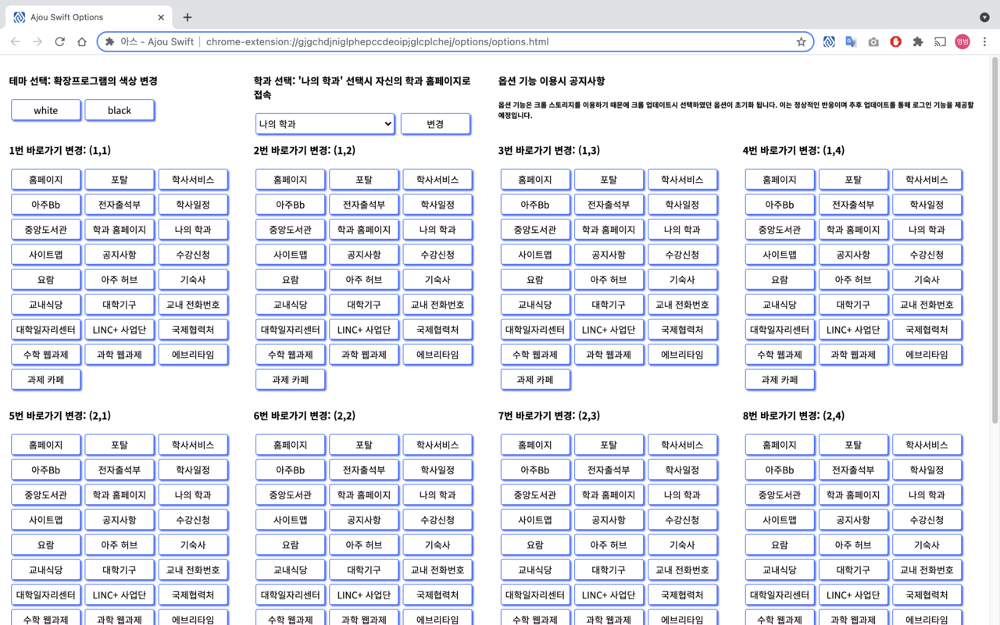

# [아스 - Ajou Swift](https://ajou-swift.xyz/)

[](mailto:gnyf0915@gmail.com)

| browser | Version    | Recent Update Date | Download                                          |
| ------- | ---------- | ------------------ | -----------------------------------------------   |
| Chrome  | v1.3.0     | 2023.10.05         | [💾 Chrome Store](https://bit.ly/AjouSwift-Chrome) |
| Whale   | v1.3.0     | 2023.10.05         | [💾 Whale Store](https://bit.ly/AjouSwift-Whale)   |

'아스 - Ajou Swift'는 아주대학교 재학생들이 필요한 다양한 교내 페이지들을 모은 크롬·웨일 확장프로그램입니다.

손쉽게 크롬에 추가하여 검색 기능, 페이지 바로가기 기능, 중요 학사일정 안내 기능을 이용하실 수 있습니다.

총 25개의 웹 페이지를 제공하며, 옵션 버튼을 통해 12개의 페이지를 선택할 수 있습니다.

제공 페이지는 다음과 같습니다.

- 홈페이지
- 포탈
- 학사서비스
- 아주Bb
- 전자출석부
- 학사일정
- 중앙도서관
- 학과 홈페이지
- 나의 학과
- 사이트맵
- 공지사항
- 수강신청
- 요람
- 아주 허브
- 기숙사
- 교내 식당
- 대학기구
- 교내 전화번호
- 대학일자리센터
- LINC+ 사업단
- 국제협력처
- 수학 웹과제
- 과학 웹과제
- 에브리타임
- 과제 카페

많은 이용바랍니다. 감사합니다!




# 릴리즈 노트
* 2021.01.09: 알파 버전 출시
  * 바로가기 기능 추가
 
* 2021.01.12: 베타 버전 출시
  * 검색 기능 추가

* 2021.01.18: 1.0.0 버전 출시
  * 바로가기 선택 기능 추가
  * 학사일정 기능 추가

* 2021.02.20: 1.1.0 버전 출시
  * 바로가기 선택 항목 추가
  * 나의 학과 바로가기 기능 추가

* 2021.02.24: 1.1.1 버전 출시
  * 나의 학과 바로가기 기능 버그 수정

* 2021.02.25: 1.1.2 버전 출시
  * 나의 학과 확인 기능 추가

* 2021.08.22: 1.1.3 버전 출시
  * 바로가기 선택 항목 추가

* 2021.09.11: 1.2.0 버전 출시
  * 4 * 3 레이아웃 적용
  * 설정 버튼 추가
  * 출시자 정보 버튼 추가

* 2021.09.26: 1.2.1 버전 출시
  * 크롬 94.0.4606.61 버전 업데이트 대응 버그 수정

* 2022.01.24: 1.2.2 버전 출시
  * 2022년 학사일정 업데이트

* 2022.02.09: 1.2.3 버전 출시
  * 2022년 학사일정 수정

* 2022.08.12: 1.2.4 버전 출시
  * Manifest V3 마이그레이션
  
* 2022.08.24: 1.2.5 버전 출시
  * 학과 바로가기 URL 수정

* 2022.10.30: 1.2.6 버전 출시
  * 2022년 학사일정 수정
  
* 2023.02.14: 1.2.7 버전 출시
  * 2023년 학사일정 수정
  * 2023년 신규 개설 학과 추가

* 2023.10.05: 1.2.7 버전 출시
  * WalkON X AjouON 배너 추가
  * Chrome Storage 초기화 문제 해결


# 저작권 표시
<a rel="license" href="http://creativecommons.org/licenses/by/3.0/"></a><br />This work is licensed under a <a rel="license" href="http://creativecommons.org/licenses/by/3.0/">Creative Commons Attribution 3.0 Unported License</a>.

본 서비스는 [Chrome Developers Extension](https://developer.chrome.com/docs/extensions/) 문서를 참고하여 출시되었습니다.

본 서비스에 사용된 모든 아주대학교 로고의 저작권은 아주대학교에 있습니다.

해당 레포를 활용하여 자교의 확장프로그램을 출시할 경우 확장프로그램 소개란과 서비스 랜딩페이지에 원작자를 표시하시길 바랍니다.

```
Origin Repo: GENYF/Ajou-Swift(https://github.com/GENYF/Ajou-Swift)
Origin: 아주대학교 크롬·웨일 확장프로그램(https://ajou-swift.xyz)
```
