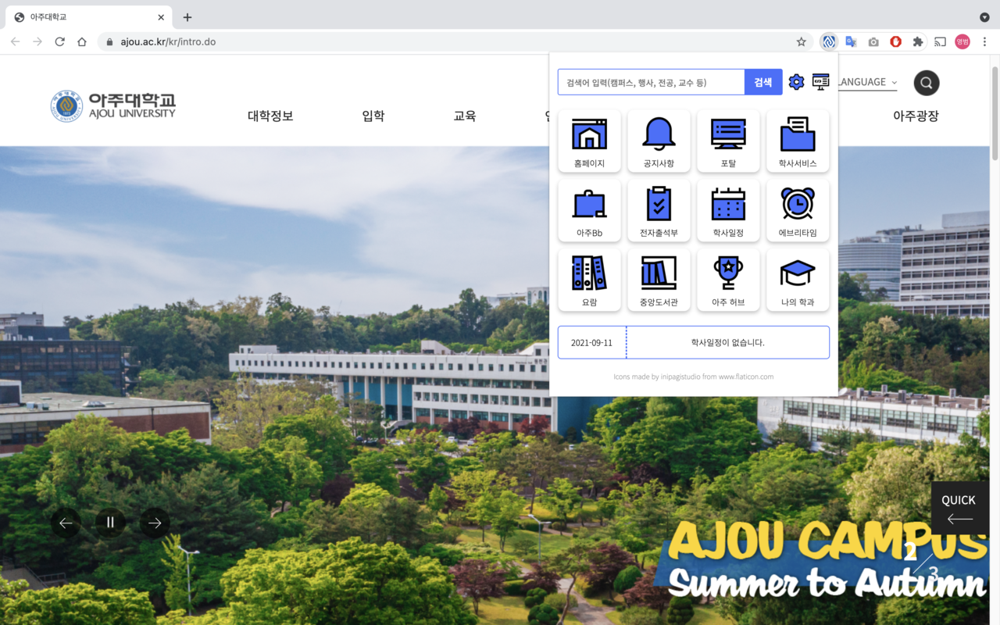

# 아스 - Ajou Swift

[](mailto:gnyf0915@gmail.com)

| browser | 버전 | 최근 업데이트일 |
| ------- | ---- | -------------- |
| chrome  | v1.0 | 2021.01.17     |
| whale   | v1.0 | 2021.01.17     |

[크롬 브라우저 아스 설치](https://bit.ly/AjouSwift-Chrome)

[웨일 브라우저 아스 설치](https://bit.ly/AjouSwift-Whale)

'아스 - Ajou Swift'는 아주대학교 재학생들이 필요한 다양한 교내 페이지들을 모은 크롬·웨일 확장프로그램입니다.

손쉽게 크롬에 추가하여 검색 기능, 페이지 바로가기 기능, 중요 학사일정 안내 기능을 이용하실 수 있습니다.

총 18개의 웹 페이지를 제공하며, 아이콘을 우클릭 후 옵션탭을 통해 9개의 페이지를 선택할 수 있습니다.

제공 페이지는 다음과 같습니다.

- 홈페이지
- 포탈
- 학사서비스
- 아주Bb
- 전자출석부
- 학사일정
- 중앙도서관
- 학과 홈페이지
- 사이트맵
- 공지사항
- 수강신청
- 요람
- 대학기구
- 교내 전화번호
- 대학일자리센터
- LINC+ 사업단
- 수학 웹과제
- 과학 웹과제

많은 이용바랍니다. 감사합니다!




# 릴리즈 노트
* 2021.01.09: 알파 버전 개발
* 2021.01.10: 검색 기능 추가
* 2021.01.11: 옵션 기능 추가
* 2021.01.12: 베타 버전 개발 및 배포
* 2021.01.13: 블랙 테마 기능 추가 및 코드 최적화
* 2021.01.14: 옵션 기능 개선
* 2021.01.15: 웨일 브라우저 대응 개발
* 2021.01.16: 일정 기능 추가 및 코드 최적화
* 2021.01.17: 크롬 및 웨일 확장프로그램 스토어 등록 요청
* 2021.01.18: 웨일 확장프로그램 스토어 등록
* 2021.01.19: 크롬 확장프로그램 스토어 등록
* 2021.01.20: 공식 출시

# 저작권 표시
<a rel="license" href="http://creativecommons.org/licenses/by/3.0/"></a><br />This work is licensed under a <a rel="license" href="http://creativecommons.org/licenses/by/3.0/">Creative Commons Attribution 3.0 Unported License</a>.

본 서비스는 [Chrome Developers Extension](https://developer.chrome.com/docs/extensions/) 문서를 참고하여 개발되었습니다.

본 서비스에 사용된 모든 아주대학교 로고의 저작권은 아주대학교에 있습니다.

해당 레포를 활용하여 자교의 확장프로그램을 개발할 경우 확장프로그램 소개란에 원작자를 표시하시길 바랍니다.

```
Origin Repo: https://github.com/GENYF/Ajou-Swift
Origin: 아주대학교 크롬·웨일 확장프로그램(https://bit.ly/AjouSwift-Whale, https://bit.ly/AjouSwift-Chrome)
```
